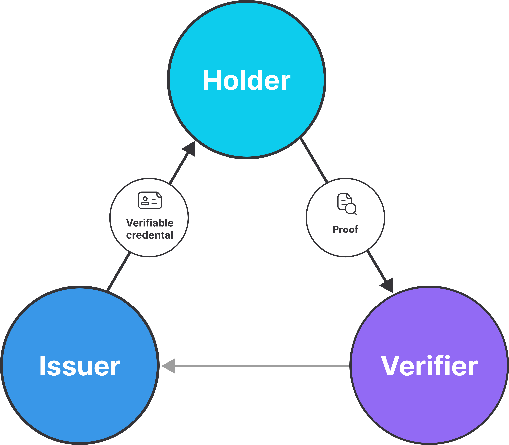

# Everscale Self-Sovereign Identity Framework (Stage 4)

* [Introduction](#introduction)
   * [What is SSI](#what-is-ssi)
   * [What is a Decentralized Identifier](#what-is-a-decentralized-identifier)
   * [What is a Verifiable Credential](#what-is-a-verifiable-credential)
* [Documentation](#documentation)
   * [Solution architecture](#solution-architecture)
   * [VC Brokerage protocol](#vc-brokerage-protocol)
   * [VC Data Model](#vc-data-model)

# Introduction

We are building SSI infrastructure for the Everscale blockchain network. This repo represents our technical stack according to the [Everscale SSI Stage 4 contest](https://forum.freeton.org/t/freeton-self-sovereign-identity-framework-stage-4/12415).

Working prototype: [pass.identix.space](https://pass.identix.space/)

## What is SSI

The self-sovereign identity (SSI) concept appears to be one of the most prominent identity technologies which shifts the locus of control over users' data and authorization functions. It gives back the power of profile control to people while preserving a prominent level of privacy and security.

The trust triangle, which is the core of the SSI ecosystem, presumes that **the Holder** owns his decentralized identifier (DID) and holds privately his verifiable credentials (VCs) issued by authorized actors - **Issuers**. These credentials are accepted and verified by **Verifiers.**

## What is a Decentralized Identifier

A decentralized identifier (DID) is a globally unique persistent identifier that does not require a centralized registration authority and enables verifiable, decentralized digital identity ([W3C](https://www.w3.org/TR/did-core)). Instead of being stored in a proprietary registry of a specific software solution, such an identifier is usually anchored in blockchain. The DID Document associated with such a DID can be used to store cryptographic materials and other relevant data, which allows the DID Holder to login with his private key and act as an agent in VC exchange.

## What is a Verifiable Credential

A verifiable credential is a tamper-evident container for authentic data that can be cryptographically verified. Such verifiable credentials may act as digital documents and can be exchanged directly between trust agents without the need for centralized intermediaries. This VC infrastructure is general-purpose: it allows subjects to implement a variety of potentially useful scenarios with a minimum cost of establishing trust.

# Documentation

## Solution architecture

[Here](docs/stage4-solution-arch.md) you can read about the architecture of services and major components of the Everscale SSI stack.

## VC Brokerage protocol
[Here](docs/vc-brokerage-overview.md) you can read about the concept of brokerage of verifiable credentials and get acquainted with current protocol implementation.

## VC Data Model
Read about VC data model, VC Lifecycle and VC Claims Specification protocol [here](docs/vc-data-model.md)

# Public repositories
[identix-pass-service](https://github.com/identix-space/identix-pass-service), [identix-pass-service-ui](https://github.com/identix-space/identix-pass-service-ui) - Identix.PASS web app (prototype)

[identix-wallets](https://github.com/identix-space/identix-wallets) - custodial SSI wallets to control DIDs/VCs

[identix-sso-service](https://github.com/identix-space/identix-sso-service), [identix-sso-ui](https://github.com/identix-space/identix-sso-ui) - Single Sign-On solution using identix-wallets