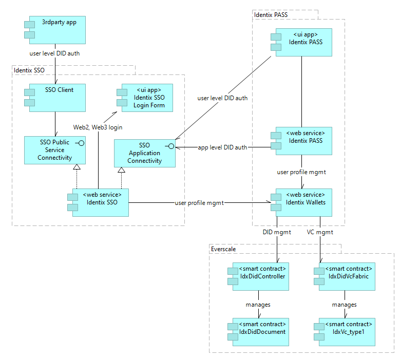

# Solution Architecture Overview

## Introduction

The requirements of Everscale SSI contest Stage 4 demand that a proposed solution must provide 
a basic implementation of SSI Triangle of Trust with Issuer, Holder, Verifier roles, and also VC issuance 
and verification procedures.

The core conception that drives the architectural decisions the Identix team has made is 
[Verifiable Credential Brokerage Protocol](vc-brokerage-overview.md). The design described in this document 
and the working solution delivered as a nomination for the contest implement a part of VCBP, the basic subset of
roles, operations, and components, necessary to meet the contest's criteria.

## Architecture of services and major components

The solution architecture the Identix team proposed for the contest Stage 4 should be considered as a prototype
for the perspective SSI ecosystem. The two main product parts of it are Identix.SSO and Identix.PASS. They include 
a number of internal services and components, and rely on Everscale as a backbone for DID and VC anchoring systems.

### Identix SSO and custodial wallets
Identix Single Sign-On is a service that allows both Web2 and Web3 users to become parties of 
decentralized trust relationships and participants of trust transactions using [DIDs](https://www.w3.org/TR/did-core/).
Google, Facebook, Twitter users may utilize their corresponding Web2 accounts to create a *custodial wallet* via 
Identix SSO with literally one click. For [Everwallet](https://wallet.broxus.com/) users there is also a possibility to
create a DID using a connected wallet. The created DID is then associated with a used Web2 or Web3 account to control

> The proposed solution implements 'custodial wallets' to control DIDs and VCs for both cases, since there is no
fully functional [VcWallet](vc-brokerage-overview.md#vcwallet) currently in the market. That means that 
Identix keeps a key pair and operates in VCBP on behalf of a user. In the future, when the VcWallet implementation
will appear, control transfer of these DIDs to non-custodial wallets will be possible. 

Identix.SSO also allows registered third-party applications to use the single sign-on functionality to bring their 
user audience into the world of decentralized trust. 

### Anchoring system for the DID management
The Stage 4 solution implements the two anchoring systems. The DID anchoring system is an evolution of 
DID management system we previously created at Stage 3. Everscale blockchain is used to fix DID document anchors and 
the developed `did:ever` [method]() is used to construct DIDs.

The DID anchoring subsystem is designed with the two smart contracts:
1. The DID fabric and controller: `IdxDidRegistry` [(code)](https://github.com/identix-space/identix-ssi-contracts/blob/master/anchor/everscale/did-management/IdxDidRegistry.sol)
2. The DID document anchor: `IdxDidDocument` [(code)](https://github.com/identix-space/identix-ssi-contracts/blob/master/anchor/everscale/did-management/IdxDidDocument.sol)

> For Stage 4, the main purpose of `IdxDidDocument` is to bind a user DID with a user public key. 
Further development may include extensions to that by adding e.g. capability or delegation relationships,
as per [DID Core §5.3.4](https://www.w3.org/TR/did-core/#capability-invocation). 

### Anchoring system for the VC management
VC anchoring in a blockchain is supposed to address requirements of non-repudiability and unforgeability 
in the first place, but known issues with privacy, unlinkability and trust/certificate chaining may arise, 
which can lead to certain trade-offs.
Generally, VCBP doesn't require any anchoring or any specific anchoring to function, leaving room 
for different configurations. The specialized implementation of VC brokerage protocol, 
which is implemented by Identix for Stage 4, does contain an anchoring system for VCs being managed. 

1. Body of a VC instance is considered private information and is not supposed for public disclosure.
 `#Privacy`
2. VC is stored as a standard, signed [JWT](https://datatracker.ietf.org/doc/html/rfc7519), and kept as a part of
the user profile/data vault. For custodial accounts of Stage 4, the Identix Wallet service realizes this storage function.
 `#Unforgeability`
3. VC contains a set of [claims](https://www.w3.org/TR/vc-data-model/#claims) about a subject or subjects, 
organized in claim groups, according to VC Claim Specification (see [Stage 4 VC Data Model](vc-data-model.md)). 
Each claim group is treated as a unit of trust, and issued, signed, presented and verified as a whole. 
This allows a user to get a VC from the issuer(s) in a single transaction while disclosing claims partially.
 `#Privacy`, `#Unlinkability`, `#Unforgeability`
4. Anchor smart contract, uniquely associated with a VC instance, only stores a secured HMAC hash and a signature 
of each claim group of the VC. Nothing from these data items can provide information on the semantics of claims,
types of claims, VC subject, or holder.
 `#Unlinkability`, `#Unforgeability`
5. VC anchor stores an issuer's public key, which is considered public information. This design, however, 
doesn't hamper other implementation schemes, when a public key may be encrypted, generated for one-time use, or secured
otherwise.
 `#Trust Chaining`

### Identix PASS
Identix.PASS is a service that provides users access to operations with VC. Identix.PASS backend implements 
VC Agent and VC broker functionality, while Identix.PASS frontend application impersonates users via Identix.SSO
to bind VC agents and VC brokers to a user identity, and provides necessary UI.

Identix.Wallets service is an infrastructure service that stores custodial wallets. It is not intended for public use.

For an end-user, Identix.PASS interface is a central point of contact and the tool for accessing 
decentralized trust capabilities Identix offers; VC management is the first to mention.

# Future directions
The proposed Stage 4 solution both from architectural design and service implementation perspectives is a prototype
of an envisioned Identix SSI ecosystem. We see a range of directions and dimensions of evolution aimed to address
the rising demand in the sphere of digital trust and decentralized identity. 
One of the major future undertakings is to make Verifiable Credential Brokerage Protocol a flexible public standard 
of building digital trust relationships and operations, and supporting it with a capable ecosystem of public services.
