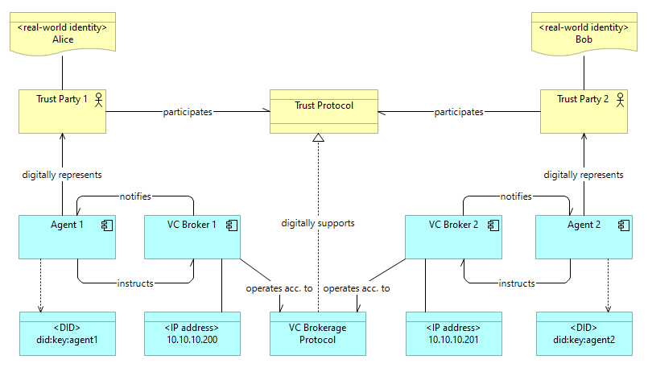
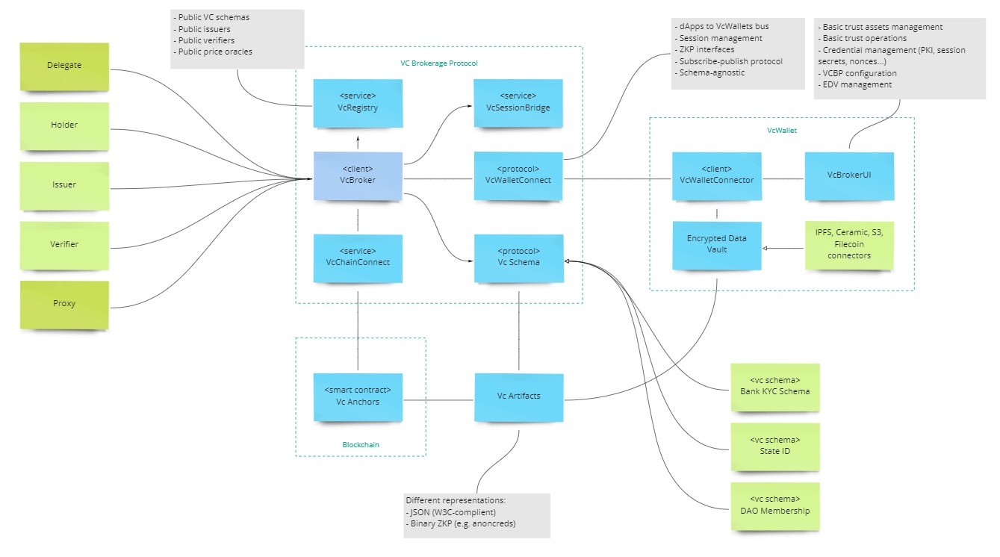

# Verifiable Credentials Brokerage Protocol and framework overview

## Introduction

SSI itself is a specific trust protocol and a trust architecture with more or less defined [characteristics]()
and implementation requirements. [Decentralized Identifiers (DIDs)](https://www.w3.org/TR/did-core/) 
and [Verifiable Credentials (VCs)](https://www.w3.org/TR/vc-data-model/) 
become important components of digital trust to serve Web3 community with their privacy, identity
and security demands. In the present, there are dozens of VC implementations, quite a number 
of architectural approaches of different levels of maturity and capability, a handful of standardization attempts. 
Still, the Web3 community and the DeFi market are highly diverse in technological and business dimensions, 
thus there is a lot of room for differentiation and experiments. 

Identix develops its own approach to SSI and decentralized trust. We strive to comply with known W3C standards
and to take into account the experience of other communities (DIF, Hyperledger Aries, OpenID etc.), while attempting 
to bring certain conceptual novelty, optimize market fit and reduce total technological costs for an SSI solution.

## VC Brokerage Protocol

The principal part of the Identix approach to Self Sovereign Identity is the concepts 
of *brokerage of verifiable credentials* and *VC brokerage protocol*.

A concept that currently became very popular in Web3 is the concept of [agency](). *Agent* (principal, subject) 
is a multidimensional notion that can represent both human and computational entities. 
Networks of agents and transactional models of interaction 
is a consensual, de-facto standard way to think about processes in digital society and economy. 
A *broker* is the same way a sort of agent, an intermediary that encapsulate or isolate a part of communication network 
to reduce overall complexity. Agents like humans or applications need to carry out  
trust communication with other agents, and by an agreement rely on *brokers* to make all necessary actions. 
Brokers isolate protocol implementation details from the corresponding participating agent parties. 
Thus, a protocol of trust between the parties is not affected by variability of brokerage protocol implementations 
(e.g. changes in communication channels or storage media).

A network of **VC brokers** encapsulates a part of specific trust communication and realizes a certain 
brokerage protocol. **VC Brokerage Protocol**
- enables trust between parties by regulating a *lifecycle of shared Verifiable Credentials*;
- defines a set of interactions between brokers: *broker to broker interface*;
- defines a set of interactions between a broker and an agent it serves: *agent to broker interface*;
- defines common privacy, security, identity etc. parameters and configuration items to represent the former;
- defines a way to share and access common configuration items of the protocol, like VC schemas registries;
- defines a way for brokers to discover other brokers in the communication network.

One can find a developed example of similar brokerage protocol in  
[DIDComm v2.0](https://identity.foundation/didcomm-messaging/spec/#discover-features-protocol-20), 
though it's not referenced to as such. 
Relatively to VCBP, DIDComm protocol stands below in the communication stack, so that DIDComm messaging may be used 
to support VCBP in more native Web3 manner than e.g. plain HTTPS.

## VCBP agency model and DIDs

An agent in VCBP is a digital identity, which impersonate a real-world principal, uniquely represented 
by a decentralized identifier (DID), capable to perform protocol operations via authorized digital services.

> While generally DID operations starting from authentication are controlled by privately held secret key(s),
> the presented solution offers 'custodial wallets' and [Single Sign-On service]() as an intermediate solution 
> for users who want to use their Web2 authentication services for the operations, that require DIDs.

The VCBP is a protocol that regulates how verifiable credentials are issued, signed, stored, transmitted, 
verified, disposed etc upon a communication network.

A concrete subset of the operations forms 
a *role* of an agent. The minimal set of agent roles, required for a protocol to work, is called 
['triangle of trust'](https://www.evernym.com/blog/gentle-introduction-verifiable-credentials/):
- Issuer: creates a VC instance, signs the instance in most scenarios;
- Verifier: verifies a VC instance for a purpose, e.g. authorization;
- Holder: manages VC instances.

There can be decompositions and/or specializations of those roles of diverse kinds: Proxy, Delegate, Presenter etc

> According to the Stage 4 Contest requirements, in the presented solution only the basic roles are implemented

VC Broker is a technological component that represents an agent in protocol communications for any enabled role.

A VCBP agent can be implemented in a variety of ways, including but not limited to:
- Standalone web service;
- In-browser 'smart wallet' application;
- Onchain smart contract;
- Mobile application;
- Everscale DeBot.

## Core VCBP components

The conceptual framework of VCBP consists a range of components.

### VC Broker
The core functional component with 2 major interfaces:
1. Brokerage, two-way broker-to-broker communication;
2. Servicing, two-way agent-to-broker communication.

### VcWalletConnect
A facility to connect VCBP agents to each other. This is similar to the well-known service [WalletConnect](), 
though the connectivity protocol must be extended to support specific features like DID-addressable agent 
and DID-addressable communication sessions.

### VcSessionBridge
A facility to support VC-enabled communication sessions, established via VcWalletConnect.

### VcChainConnect
A blockchain abstraction and implementation layers for brokerage protocols with [anchoring]().

### VcAnchors
Anchors are smart contracts that represent some persistent state and associated logic on a blockchain of choice.
The anchoring systems are widely used in DID- and VC-related solutions 
(e.g. see [DIF SideTree Protocol](https://identity.foundation/sidetree/spec/))

The main purposes to use anchors in the present solution are:
1. Anchoring DIDs
2. Anchoring VCs

### VCBP Registries
In order to operate, VCBP requires a consensus or shared knowledge among agents/brokers in the communication network 
about a number of facts:
1. DIDs. All parties need to authenticate or authorize particular agent in a decentralized manner 
using his/her public keys, associated with a provided DID. A DID registry of a sort may store this information 
or store routing data that can help to access it.
2. Verifiable Credential Schema. Issuer and Verifier need to agree on what data and in which format represent some real-world semantics as a verifiable claim.
3. Public issuers. Holders may need to know if there are publicly acknowledged services that can author 
a trusted VC about a subject of his/her interest.
4. Public verifiers. Holders (and sometimes Issuers) may need to know how to access particular service 
for authorization purpose, and what are their requirements, in terms of requested claims and evidences.

### VcSchema
VC schema is an agreement of how a particular claim about a subject of interest is represented 
for purposes of both issuing and verifying a VC.

### VcArtifacts
An instance of an issued VC may be represented in a number of forms, even having the same VC schema. JWT, JSON, BSON
(and an engraved stone if you like monumental things) to mention a few. Specific 'reification' of a VC instance 
is required to allow persistence and transport over communication channels. The latter may involve format transformations.

### VcWallet
VcWallet is one of possible realizations of a VCBP agent. A simple design of it may include
- VcWalletConnector to participate VcWalletConnect communication;
- Encrypted Data Vault to store VcArtifacts, secret keys, nonces and other protocol information. 
There can be many options to physically store the vault data in a secure manner (IPFS, cold storage, S3...);
- UI to communicate to a user, a trust party, who is impersonated by the agent
- VC Broker.

## Protocol extensibility dimensions

The proposed framework and the concept of VC brokerage protocol itself are required to allow a wide range 
of protocol variations to address variability of the Web3 world. We can delineate a few dimensions where VCBP
must be able and have to be extended and specialized:
- User scenarios perspective: introduce specific roles or advanced trust transactions;
- Technological stacks: VCBP is technologically agnostic;
- Cryptographic schemes and algorithms for signing, encryption, ZKP etc;
- VC representations (JSON-LD, JWT);
- Communication channels: from plain HTTP/GET to DIDComm;
- Payment: onchain anchoring systems especially may provide a number of options to monetize VC transactions.