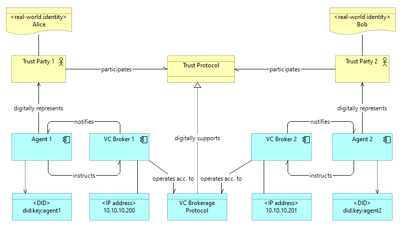

# Introduction

SSI itself is a specific trust protocol and a trust architecture with more or less defined [characteristics]()
and implementation requirements. [Decentralized Identifiers (DIDs)]() and [Verifiable Credentials (VCs)]() 
become important components of digital trust to serve Web3 community with their privacy, identity
and security demands. In the present, there are dozens of VC implementations, quite a number 
of architectural approaches of different levels of maturity and capability, a handful of standardization attempts. 
Still, the Web3 community and the DeFi market are highly diverse in technological and business dimensions, 
thus there is a lot of room for differentiation and experiments. 

Identix develops its own approach to SSI and decentralized trust. We strive to comply with known W3C standards
and to take into account the experience of other communities (DIF, Hyperledger Aries, OpenID etc.), while attempting 
to bring certain conceptual novelty, optimize market fit and reduce total technological costs for an SSI solution.

# VC Brokerage Protocol

The principal part of the Identix approach to Self Sovereign Identity is the concepts 
of *brokerage of verifiable credentials* and *VC brokerage protocol*.

A concept that currently became very popular in Web3 is the concept of [agency](). *Agent* (principal, subject) 
is a multidimensional notion that can represent both human and computational entities. 
Networks of agents and transactional models of interaction 
is a consensual, de-facto standard way to think about processes in digital society and economy. 
A *broker* is the same way a sort of agent, an intermediary that encapsulate or isolate a part of communication network 
to reduce overall complexity. Agents like humans or applications need to carry out  
trust communication with other agents, and by an agreement rely on *brokers* to make all necessary actions. 
Brokers isolate protocol implementation details from the corresponding participating agent parties. 
Thus, a protocol of trust between the parties is not affected by variability of brokerage protocol implementations 
(e.g. changes in communication channels or storage media).

A network of **VC brokers** encapsulates a part of specific trust communication and realizes a certain 
brokerage protocol. **VC Brokerage Protocol**
- enables trust between parties by regulating a *lifecycle of shared Verifiable Credentials*;
- defines a set of interactions between brokers: *broker to broker interface*;
- defines a set of interactions between a broker and an agent it serves: *agent to broker interface*;
- defines common privacy, security, identity etc. parameters and configuration items to represent the former;
- defines a way to share and access common configuration items of the protocol, like VC schemas registries;
- defines a way for brokers to discover other brokers in the communication network.

A well-developed example of similar brokerage protocol is [DIDComm](), though it's not referenced to as such. 
Relatively to VCBP, DIDComm protocol stands below in the communication stack, so that DIDComm messaging may be used 
to support VCBP in more native Web3 manner than e.g. plain HTTPS.

# VCBP agency model and DIDs

An agent in VCBP is a digital identity, which impersonate a real-world principal, uniquely represented 
by a decentralized identifier (DID), capable to perform protocol operations via authorized digital services.

> While generally DID operations starting from authentication are controlled by privately held secret key(s),
> the presented solution offers 'custodial wallets' and [Single Sign-On service]() as an intermediate solution 
> for users who want to use their Web2 authentication services for the operations, that require DIDs.

The VCBP is a protocol that regulates how verifiable credentials are issued, signed, stored, transmitted, 
verified, disposed etc upon a communication network.

VCBP agent manages a subset of the whole range of operations on VCs. A concrete subset of the operations forms 
a *role* of an agent. The minimal set of agent roles, required for a protocol to work, is called 
['triangle of trust'](https://www.evernym.com/blog/gentle-introduction-verifiable-credentials/):
- Issuer: creates a VC instance, signs the instance in most scenarios;
- Verifier: verifies a VC instance for a purpose, e.g. authorization;
- Holder: manages VC instances.

There can be decompositions and/or specializations of those roles of diverse kinds: Proxy, Delegate, Presenter etc

> According to the Stage 4 Contest requirements, in the presented solution only the basic roles are implemented

VC Broker is a technological component that represents an agent in protocol communications for any enabled role.

# Core VCBP components

The conecptual v

