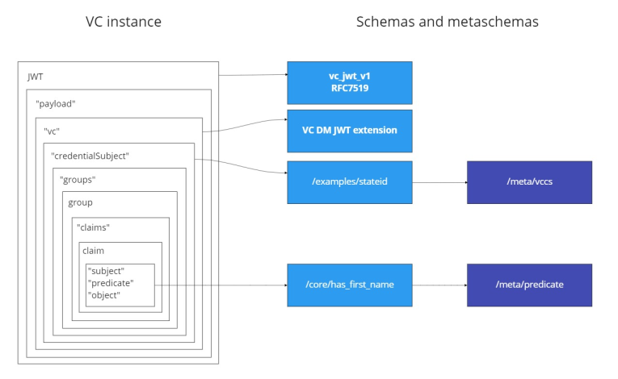

# Verifiable Credential Lifecycle, Data Model and Implementation Design

## Introduction
A Verifiable Credential is an entity, which [VC brokerage](vc-brokerage-overview.md) is circling around.
Identix team's view on this concept is coherent with [the common W3C doctrine](https://www.w3.org/TR/vc-data-model/).
The actual VC lifecycle design and implementation add certain specifics, but strive to comply to other
mature (like [JWT](https://datatracker.ietf.org/doc/html/rfc7519), [DIDs](https://www.w3.org/TR/did-core/)) or
emerging (like [EDV](https://digitalbazaar.github.io/encrypted-data-vaults/))
Web standards, and to reuse approaches we see advantageous (like anchoring
from [DIF SideTree](https://identity.foundation/sidetree/spec/) or
anoncreds from [Hyperledger Aries](https://github.com/hyperledger/indy-hipe/tree/main/text/0109-anoncreds-protocol)).

This document doesn't explain the Identix concept in all details, but rather focuses on the design
for the [Everscale Contest Stage 4](https://forum.freeton.org/t/freeton-self-sovereign-identity-framework-stage-4/12415)
implementation, accompanying by a few indications of the planned future developments.

## The target trust scenarios
The target scenarios are based on the VC Brokerage Protocol's
[agency model](vc-brokerage-overview.md#vcbp-agency-model-and-dids). From all multitude and variability of
digital trust relationships the Stage 4 implementation covers the following, as specified in contest's
[hard criteria](https://forum.freeton.org/t/freeton-self-sovereign-identity-framework-stage-4/12415#hard-criteria-7):

>1. The Issuer issues Verifiable Credentials with assertions about the subject.
>2. The Holder possesses Verifiable Credentials and presents them to Verifiers.
>3. The Verifier ensures:
>   1. VC’s relation to the certain statement
>   2. VC’s relation with the Subject
>   3. VC is authentic (cryptographically certified by the Issuer)

According to this requirement, the Stage 4 solution realizes the following procedures:
1. An Agent signs in to Identix.PASS and can act impersonating any of normative roles:
Holder, Issuer, Verifier. Successful sign in attempt results creates or activates a user account with associated DID.
   > An agent needs no re-login to switch a role. Role functions are separated on UX/UI level.
2. As an Issuer, the agent can `issue a VC` of a type of choice to a Holder, by specifying the Holder's DID
and other data, according to [VC Claims Specification](#vc-claim-specifications) of the VC type.
   > - VC issuance requests from Holder to Issuer is a subject for further developments and is not implemented for the Stage 4.
   > - In future versions, Issuers will have to explicitly declare a list of VC types they serve. Current implementation is free from this restriction.
   > The "Issuer - VC type list" associations must be available at a VCBP Registry.
   > - Potentially, there can be many Issuers to sign a single VC. Support for such scenarios with even more complex trust chaining is also envisioned.  
3. Once issued, the VC instance delivered to the `Holder to possess` and can be found at his/her wallet.
4. For VCs at Holder's disposal, he/she can `request verification` by choosing a provided verifier service and sending a message.
   > Currently, ony one agent is declared to be a verifier (find "FlatQube"). For the protocol to work, verifiers have to publish their 
   > wanted VC type lists the same way as Issuers do. VCBP Registry for these purposes will be implemented in future versions.
5. The chosen verifier receives the request in their inbox list and can review the VC data sent
and `Approve` or `Reject` the verification. Cryptographic operations, required to ensure integrity of credentials 
and certificate chains are performed automatically. A secret code(s) that allows Verifier to access the information
is sent as a part of this interaction.
   > Some scenarios may require more complex interactions between Issuer and Holder for issuance
   > and between Holder and Verifier. These may include sharing symmetric RSA keys, HMAC secrets, nonces etc,
   > and also a few-round communication between signers, like in Schnorr' scheme. All those peculiarities must be
   > hidden from user under the hood of VC Brokerage Protocol implementation. Secrecy, required for the certain data,
   > must be provided by agent's Encrypted Data Vault and VC Broker, so no sensitive data will ever leave the agent's
   > process boundary and EDV storage area.

## VC Claims Specification
In order to make a digital trust transaction to happen, a set of contracts between actors and between VCPB brokers
must be established: semantical, syntactical, procedural. VC Brokerage Protocol
[specifies](vc-brokerage-overview.md#vc-brokerage-protocol) this set of high-level contracts,
and represents itself a *metacontract* in this respect.

The contracts must ensure all parties understand each other, meaning all trust procedures are coherent
in an expected order of execution and in terms of their input and output artifacts.

Contracting the protocol communication around Verifiable Credentials needs to address several layers
of representation and interpretation.
Fortunately, most of them are already addressed by the community, but there are [debatable] reasons
for VCBP trust architects to make additional efforts in order to introduce certain novelty. 

1. **Representation layer** contract specifies how VC's body is stored and transmitted over the wire. Since the format 
may affect data integrity, it must be regulated to a reasonable extent. We chose JSON Web Token as 
a final destination of VC composition (see [VC Representation](#vc-representation) for the schema), 
plus an Everscale smart contract for VC anchoring (see [VC anchoring](#vc-anchoring)).
2. **VC syntax layer** contract regulates how the transmitted object is interpreted to be a Verifiable Credential 
having its specific properties. We chose the Verifiable Credentials Data Model W3C Recommendation 
[v1.1](https://www.w3.org/TR/vc-data-model/) over JSON as the VC syntax standard.
3. **Claim syntax layer** contract specifies how a semantic identity of a *claim*, shared in 
a [semantic community](https://semanticcommunity.org/SemanticCommunity.aspx), is represented to have the same meaning
for all parties of trust relationships. W3C standards tend to reuse one of the most elaborated syntaxes
to represent domain semantics: [JSON for Linked Data](https://w3c.github.io/json-ld-syntax/). It definitely makes sense
in the long run, but this approach has a [number of drawbacks]() in terms of cognitive load, performance, total cost
and overall solution complexity. Particularly for the VC context, there are issues related to
zero knowledge proofs and partial disclosure concerns, which e.g. motivated Hyperledger team to elaborate on
a specific binary format for representing claims: [anoncreds](https://github.com/hyperledger/indy-hipe/tree/main/text/0109-anoncreds-protocol).
<br>The presented Stage 4 solution introduces a hybrid approach, which allows simple claims, represented as
[RDF triples](https://www.w3.org/TR/rdf11-concepts/#dfn-rdf-triple) to be compacted in a set of binary attributes,
similar to those from anoncreds. This form gives more freedom to use advanced cryptographic approaches,
elevate privacy, and significantly reduce VC anchor size, what may be advantageous for reasons of reducing storage costs
in Everscale. 

### Scheme as a contract

The Verified Credential Claims Specification is a scheme, which contracts

1. Syntax to express a `claim`.
<br>Each claim thus become an atomic **artifact of shared meaning**.
2. Syntax to express a `group of claims`.
<br>Assumed, that for the most of practical cases, a *set* of semantically bound atomic claims is required to express a
fact, valuable for a trust transaction.
<br>Each claim group thus become an atomic **artifact of shared data**. E.g. first name, middle name and last name
may be considered semantically different, but can be meaningfully shared only as group to address a subject individual
in the respect of own names. Maybe more important, this will allow certain flexibility for partial disclosure and storage optimization. 

W3C Recommendation makes the symmetric conceptual differentiation, partially for the sake of mereology:
*"A credential is a set of one or more claims made by the same entity."* [VC DM §3.2](https://www.w3.org/TR/vc-data-model/#credentials)
<br>The aggregation hierarchy, proposed here, `VC -> ClaimGroup -> Claim` does more to that. 
A verifiable credential instance thus become an atomic **artifact of trust transaction**, and provides common
trust context (e.g. certificate chain) for the members.

## VC composition and VCCS protocol
1. Claim is expressed as `Subject-Predicate-Object` RDF triplet.
   1. `Subject` is always a DID of VC's subject.
      > It is possible to `reify` a claim in the LD-like manner in the future VCCS version by assigning an identity
      > to them to get an RDF graph and allow OWL-like reasoning. However, this adds extra complexity and known problems,
      > not all of which have good solutions.
   2. `Predicate` is a DID of a shared predicate. A predicate definition may impose requirements on associated `Object`
   3. `Object` is an arbitrary value. Only simple values are currently allowed.
2. Claim group is expressed as named set of claims and has a signature of a hash of its JSON representation,
that certifies integrity and authenticity. The name of a claim group must correspond to a DID of a claim group specification.
3. VC instance is expressed as a set of claim groups accompanied by common procedural properties (like date and place of issuance),
and common security parameters.
4. A VCCS must be defined and published in a shared registry.
5. A VCCS is a named (DID) set of named claim group specifications.
6. A claim group specification is a set of predicate DIDs.
7. Predicates must be defined and published in a shared registry as individual nodes.
8. Predicates definition must contain
   1. unique DID;
   2. human-readable name;
   3. optional set of object type restrictions.
9. VCCS and predicate definitions are JSON files, constructed according to normative schemas.

## Validation of the structure 

See an example JWT [https://schemas.identix.space/examples/vc/basic_kyc](https://schemas.identix.space/examples/vc/basic_kyc)

1. Root JWT representation is constructed according to the JSON schema `vc_jwt_v1` [https://schemas.identix.space/vc/vc_jwt_v1](https://schemas.identix.space/vc/vc_jwt_v1)
   > - The presented structure of JWT follows the recommendation of [RFC7519](https://www.rfc-editor.org/rfc/rfc7519)
2. `vc` node inside `payload` node of the JWT structure is an extension node, according to recommendations of W3C
[VC DM](https://www.w3.org/TR/vc-data-model/#json-web-token-extensions)
3. `credentialSubject` node of the `vc` node is that contains an array of `claim_groups`.
This array represents the key VC content: a set of claims.  
4. Schema for these claim groups, according to which a VC is constructed, is defined as a VC Claims Specification,
like the one here: [https://schemas.identix.space/examples/vccs/stateid](https://schemas.identix.space/examples/vccs/stateid) 
5. Such VCCS definitions are JSON representations, constructed according to the JSON Schema [https://schemas.identix.space/meta/vccs](https://schemas.identix.space/meta/vccs)
6. Such VCCS definitions use predicate specifications, like `has_first_name` [https://schemas.identix.space/core/has_first_name](https://schemas.identix.space/core/has_first_name)
7. Such predicate definitions are JSON representations, constructed to according the JSON Schema [https://schemas.identix.space/meta/predicate](https://schemas.identix.space/meta/predicate)
8. All the JSON schemas themselves are constructed according to JSON metaschema [http://json-schema.org/draft/2020-12/schema](http://json-schema.org/draft/2020-12/schema),
so the definitions can be validated by any [JSON Schema validator](http://json-schema.org/implementations.html#validators).



> The Stage 4 schema repository contains a Python 3 validator script that does the validation of the whole set of schemas
> See here [https://github.com/identix-space/schemas](https://github.com/identix-space/schemas)

### Example
Let the DID `did:ever:123` was acquired by a respected individual we know as Pete Petrov. Then the triplet<br>
`"did:ever:123" “has_first_name” “Pete”`<br>
specifies (the claim syntax) that such association exists somewhere, and that certified by a trusted agent - issuer.<br>
`"did:ever:123" “has_last_name” “Petrov”`<br>
gives us another valuable claim, which combined may form a group "names" for a Government ID verifiable credential.
Corresponding VC Claim Specification (name it `StateID`), which includes a requirement like `["has_first_name", "has_first_name"]`
requires all VCs, which declare compliance with this specification to have claims with the indicated predicates.

### Lifecycle of VC Claim Specification
| Practice name | Description |
| --- | --- |
| Designing a specification | A VCCS is constructed as a named group of requirements for the presence of predicates in a VC instance. The requirements for the presence of statements are constructed as a named ordered group of 3 elements, in accordance with the `Subject Predicate Object` RDF syntax |
| Validating a specification | The constructed specification must be validated by a public VCCS registrar |
| Publishing a specification | A valid specification is published by the registrar as an artifact, available for retrieval by VCCS instance' URN (DID). |
| Constructing a VC request | A VC request (to the Issuer) must include a reference to a VCCS, according to which involved parties have to provide data to construct a set of claims for a VC instance |
| Constructing a VC instance | Constructing a VC instance consists of constructing unit claims and grouping them according to the selected scheme, and creating all the necessary certificates for this group |
| Validating a VC instance | Validation of the VC instance means checking presence of all claim groups and claims in a submitted VC in accordance with the specified VCCS |
| Verifying a VC instance | Checking that the entire group of certificates associated with each group of claims comply with requirements of required trust protocol (cryptographic signature, expiration date, etc.) |
| Revocation of a specification | Formal revocation of a VCCS is not expected. The actual decommissioning of a VCCS instance (for example, as a result of a failure of the registrar's service) only means the absence of a public contract. This does not imply the termination of trust relationships between counterparties, but only limits, complicates or reduces the level of trust in them, which remains at the discretion of the counterparties. |

## VC anchoring
### Oncnain anchors motivation and design goals
#### 1. Ensure non-repudiability
Issuing party cannot deny a specific VC was issued.
Smart contract data submitted to blockchain network cannot be deleted by any party.
The single exception is Everscale storage payment policy, according to which a deployed smart contract consumes
some amount of gas on as a storage fee for validators, and as soon as account's balance goes below zero,
the account gets 'frozen' and its data get replaced by its hash. This behaviour may be interpreted as a VC expiration,
or as *VC anchor* expiration, so becomes a part of a business model.

#### 2. Ensure a well-known place for VC proofs, decentralized and open for public audit
A public blockchain becomes a well-known source of specific evidences and a trusted resolver
of trust-related identifiers (like DID). All parties don't need to rely on web services with code,
hidden on private servers, and/or on its functional logic with uncontrolled variables,
at least for some of critical segments in a trust chain.

#### 3. Ensure privacy and unlinkability
While data, stored onchain is public, only parties, authorized by Sovereign or his delegates, can have access
to semantics of these data unless it's permitted by Sovereign or other authoritative party.

#### 5. Ensure unforgeability
It must be impossible for a malicious individual to tamper credentials or signatures.

### VC anchor
The Everscale smart contracts for the VC management can be found at GitHub:
[identix-ssi-contracts](https://github.com/identix-space/identix-ssi-contracts/tree/master/anchor/everscale/vc-management)

Claim groups are represented as the following structure:
```
struct ClaimGroup
{
    // HMAC-secured hashes
    uint64 hmacHigh_groupDid;
    uint64 hmacHigh_claimGroup;

    // 512 bit long signature of the full claimGroup hash
    uint256 signHighPart;
    uint256 signLowPart;
}
```
`hmacHigh_groupDid` represent high 64 bits of HMAC of a claim group id

`hmacHigh_claimGroup` represent high 64 bits of HMAC of a claim group body 

`signHighPart` and `signLowPart` are parts of a signature, produced with original claim group HMAC and issuer(s)' private key

> Current implementation uses simple Ed25519 signature, but many more advanced techniques can be used as a part of
> alternative VCBP protocols: Schnorr, BLS, BBS+ or CL.

> Release Note:
> For the relesed version (05-05-2022) VC anchoring smart contracts are ready, unit test (TS4) are functional and the VC Fabric smart contract is deployed
> at [`0:6c33236486c501865c88a67c59f50a74568ef7492c22db400bccf179483c0880`](https://ever.live/accounts/accountDetails?id=0%3A6c33236486c501865c88a67c59f50a74568ef7492c22db400bccf179483c0880).
> However, we're still resolving issues with Everscale JS SDK, hampering VC anchor deployement. Patience, we're going to fix it soon!
